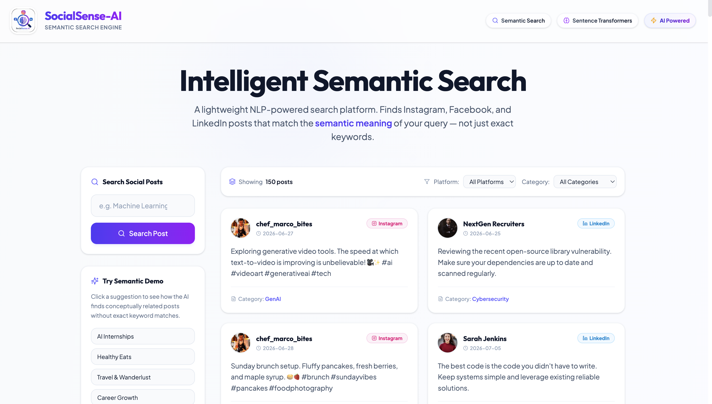
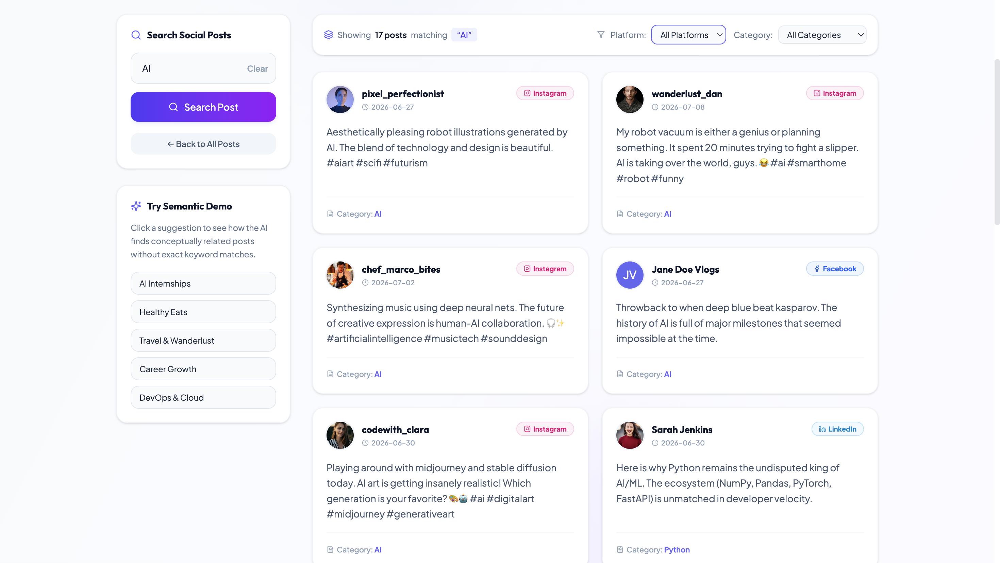
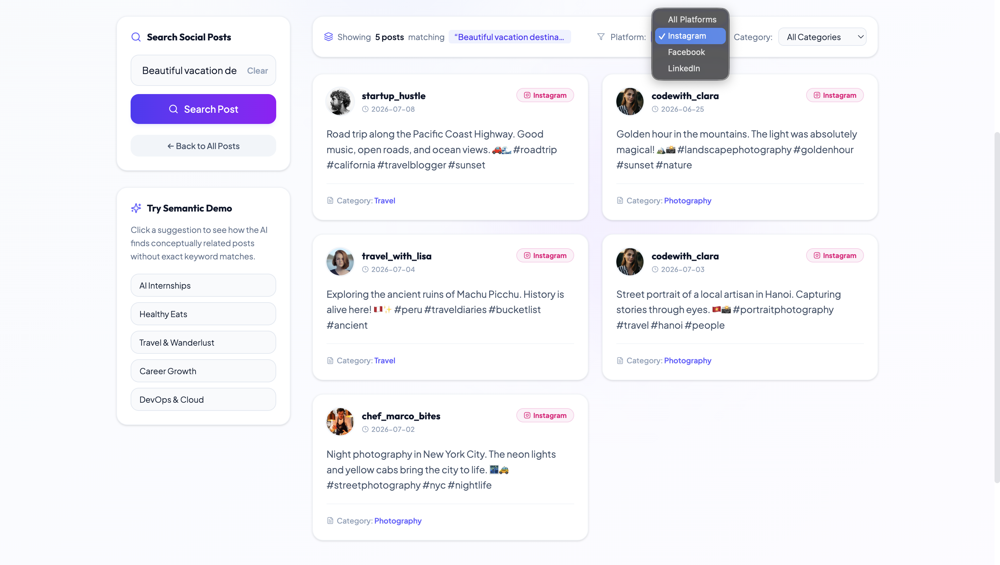

# SocialSense-AI

An AI-powered semantic social media search engine built using React, Flask and Sentence Transformers.

Unlike traditional keyword search, this project understands the meaning of a user's query and returns the most relevant posts from a simulated dataset of Instagram, Facebook and LinkedIn posts.

## Screenshots

### Home Page



### Search Results



### Filter Search



## Features

- AI-powered semantic search
- SentenceTransformer (all-MiniLM-L6-v2)
- Cosine similarity based ranking
- Search across Instagram, Facebook and LinkedIn posts
- 150 realistic mock social media posts
- Responsive React interface
- Flask REST API
- Fast in-memory search

## Why Semantic Search?

Traditional keyword search only looks for exact words.

For example, searching for:

```
AI Internship
```

will also find posts related to:

- Artificial Intelligence Internship
- Machine Learning Internship
- AI Research Internship
- Computer Vision Internship
- Generative AI Internship

The model understands the meaning of the query instead of simply matching keywords.

## How it Works

1. The Flask backend loads all posts from `posts.json`.
2. Each post caption is converted into an embedding using the SentenceTransformer model `all-MiniLM-L6-v2`.
3. These embeddings are generated only once when the server starts and stored in memory.
4. When a user enters a search query, only that query is encoded.
5. Cosine similarity is calculated between the query embedding and every stored post embedding.
6. Relevant posts are returned and sorted by similarity.

## Dataset

This project uses a custom mock dataset because official APIs for Instagram, Facebook and LinkedIn require restricted access.

Dataset Details

- Total Posts: 150
- Platforms:
  - Instagram
  - Facebook
  - LinkedIn

Categories include:

- AI
- Machine Learning
- Python
- Data Science
- GenAI
- Software Engineering
- Web Development
- Cloud Computing
- Cybersecurity
- Career
- Education
- Open Source
- Business
- Travel
- Food
- Photography
- Sports
- Festivals
- Lifestyle

Each post contains:

- id
- platform
- author
- profileImage
- caption
- date
- category

## Tech Stack

| Layer | Technology |
|-------|------------|
| Frontend | React (Vite), Tailwind CSS, Axios |
| Backend | Flask, Flask-CORS |
| AI/NLP | Sentence Transformers |
| Model | all-MiniLM-L6-v2 |
| Similarity | Cosine Similarity |
| Dataset | JSON |

## Project Structure

SocialSense-AI/
│
├── backend/
│   ├── app.py
│   ├── search_engine.py
│   ├── posts.json
│   └── requirements.txt
│
├── frontend/
│   ├── src/
│   ├── package.json
│   └── vite.config.js
│
├── screenshots/
│   ├── home.png
│   └── search-results.png
│
└── README.md

## Getting Started

### Backend

```bash
cd backend

python -m venv venv
```

Activate the virtual environment.

Windows

```bash
venv\Scripts\activate
```

macOS / Linux

```bash
source venv/bin/activate
```

Install dependencies.

```bash
pip install -r requirements.txt
```

Run the server.

```bash
python app.py
```

The backend runs on:

```
http://localhost:5001
```

### Frontend

Open another terminal.

```bash
cd frontend

npm install

npm run dev
```

The frontend runs on:

```
http://localhost:5173
```

## API Endpoints

| Method | Endpoint | Description |
|--------|----------|-------------|
| GET | /api/health | Health check |
| GET | /api/posts | Returns all posts |
| GET | /api/search?q=query | Semantic search |

## Example Searches

Try searching:

- AI Internship
- Machine Learning
- Artificial Intelligence
- Python Developer
- Data Science
- Deep Learning
- Computer Vision
- Generative AI
- Cloud Computing
- Cybersecurity
- Travel Destinations
- Healthy Recipes

## Future Improvements

- Real social media API integration
- Vector database support
- Multi-language search
- User authentication
- Search history
- Cloud deployment

## Author

Bhargav Vaghela

Built as an AI/ML internship project using React, Flask and Sentence Transformers.

